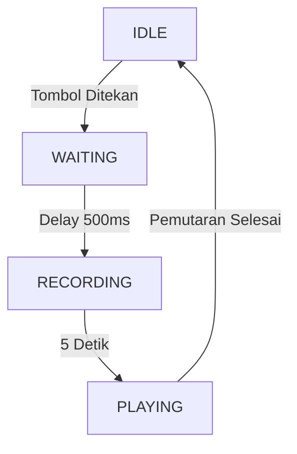

# ESP32-S3 Voice Monitoring dengan Display OLED 0.91"

Sistem perekam dan pemutar suara canggih menggunakan mikrokontroler ESP32-S3 dengan tampilan real-time dan indikator LED status.


## 📋 Gambaran Proyek

Proyek ini mengimplementasikan perekam suara 5 detik dengan fitur-fitur berikut:
- Kemampuan perekaman 5 detik dengan kualitas audio tinggi
- Display OLED I2C 0.91" (128x32) untuk feedback status real-time
- LED RGB WS2812B untuk indikasi status visual
- Penanganan tombol pintar dengan delay 500ms untuk melewati suara klik tombol
- Update display teroptimasi untuk mencegah flicker
- Pelacakan progress real-time dengan countdown dan progress bar

## 🎯 Fitur

### Fitur Audio
- Perekaman 5 detik pada sample rate 16kHz
- Pemutaran otomatis setelah perekaman selesai
- Pemrosesan audio dengan amplifikasi gain 2x dan limiter
- Output stereo untuk pemutaran speaker
- Filter klik tombol untuk menghindari perekaman suara mekanis

### Feedback Visual
- **Display OLED** menampilkan:
  - Countdown perekaman (5s → 0s)
  - Progress pemutaran dengan persentase dan progress bar
  - Status sistem dan instruksi
- **Indikator LED WS2812B**:
  - 🔴 **MERAH**: Sedang merekam
  - 🟢 **HIJAU**: Sedang memutar audio
  - 🟡 **KUNING**: Status menunggu (delay tombol)
  - ⚫ **MATI**: Status idle/siap

### Manajemen Status Pintar
- **IDLE**: Siap merekam, display menampilkan instruksi
- **WAITING**: Delay 500ms untuk melewati suara klik tombol
- **RECORDING**: Capture audio 5 detik dengan countdown
- **PLAYING**: Pemutaran otomatis dengan pelacakan progress

## 🛠 Persyaratan Hardware

### Komponen
- Goouuuu ESP32-S3 Board
- OLED Display 0.91" (128x32)
- Goouuu Shield  ( MAX98357A I2S Audio Amplifier dan INMP441 I2S Microphone integrated on board)
- Speaker
- Kabel USB

### Koneksi Pin

| Komponen | Pin ESP32-S3 | Deskripsi |
|-----------|--------------|-------------|
| **Display OLED** | | |
| SDA | GPIO 41 | Data I2C |
| SCL | GPIO 42 | Clock I2C |
| **Speaker (I2S)** | | |
| DOUT | GPIO 7 | Data Out |
| BCLK | GPIO 15 | Bit Clock |
| LRC | GPIO 16 | Left/Right Clock |
| **Mikrofon (I2S)** | | |
| WS | GPIO 4 | Word Select |
| SCK | GPIO 5 | Serial Clock |
| SD | GPIO 6 | Serial Data |
| **LED WS2812B** | | |
| Data | GPIO 48 | Kontrol LED |
| **Tombol** | | |
| BOOT | GPIO 0 | Trigger Rekam |

## 📥 Instalasi & Setup

### Prasyarat
- **Arduino IDE** (versi 2.0+ direkomendasikan)
- **Dukungan Board ESP32** di Arduino IDE
- Library yang diperlukan:
  - `Adafruit_GFX`
  - `Adafruit_SSD1306`
  - `Adafruit_NeoPixel`

### Instalasi Library
1. Buka Arduino IDE
2. Pergi ke **Tools** → **Manage Libraries**
3. Cari dan instal:
   - "Adafruit GFX Library"
   - "Adafruit SSD1306"
   - "Adafruit NeoPixel"

### Konfigurasi Board
1. Pergi ke **File** → **Preferences**
2. Tambahkan ke Additional Board Manager URLs:
   ```
   https://raw.githubusercontent.com/espressif/arduino-esp32/gh-pages/package_esp32_index.json
   ```
3. Pergi ke **Tools** → **Board** → **Boards Manager**
4. Cari "ESP32" dan instal
5. Pilih: **ESP32S3 Dev Module**

### Upload Kode
1. Hubungkan ESP32-S3 via USB
2. Pilih port yang benar di **Tools** → **Port**
3. Setel berikut di **Tools**:
   - **Board**: ESP32S3 Dev Module
   - **USB CDC On Boot**: Enabled
   - **USB Mode**: USB-OTG
   - **Partition Scheme**: Default 16MB
4. Upload sketch

## 🚀 Petunjuk Penggunaan

### Operasi Dasar
1. Nyalakan: Sistem menginisialisasi dan menampilkan "READY-Press BOOT" di display
2. Rekam: Tekan dan lepaskan tombol BOOT
3. Tunggu: Sistem menunggu 500ms (LED kuning) untuk melewati klik tombol
4. Bicara: Rekam pesan 5 detik Anda (LED merah, display countdown)
5. Putar: Audio otomatis diputar (LED hijau, display progress)
6. Ulangi: Sistem kembali ke status siap

### Status Display

#### Status IDLE
```
VOICE REC 5s
READY-Press BOOT
Ready to record
```

#### Status WAITING
```
GET READY...
    0.5
```

#### Status RECORDING
```
RECORDING 5s
    5s
```

#### Status PLAYING
```
PLAYING 5.0s
   75%
[██████████░░░░░░]
```

## 🔧 Spesifikasi Teknis

### Spesifikasi Audio
- Sample Rate: 16,000 Hz
- Waktu Perekaman: 5 detik
- Ukuran Buffer: 512 sampel
- Total Sampel: 80,000 (5s × 16kHz)
- Bit Depth: 16-bit (pemutaran), 32-bit (perekaman)

### Penggunaan Memori
- Buffer Perekaman: ~160KB (80,000 sampel × 2 bytes)
- Buffer Display: 512 bytes
- Buffer Audio: Multiple DMA buffers

### Performa
- Delay Tombol: 500ms (dapat dikonfigurasi)
- Update Display: Update selektif untuk mencegah flicker
- Respon LED: Perubahan status langsung

## 🐛 Pemecahan Masalah

### Masalah Umum

#### Tidak Ada Audio yang Terekam
- Periksa koneksi mikrofon (pin WS, SCK, SD)
- Verifikasi mikrofon I2S mendapat daya yang tepat
- Periksa serial monitor untuk error inisialisasi

#### Display Tidak Bekerja
- Verifikasi koneksi I2C (SDA=41, SCL=42)
- Periksa alamat OLED (0x3C)
- Pastikan suplai daya yang tepat

#### LED Tidak Menyala
- Periksa koneksi pin data (GPIO 48)
- Verifikasi daya WS2812B (5V direkomendasikan)
- Periksa setting brightness di kode

#### Tombol Tidak Merespon
- Pastikan tombol BOOT terhubung ke GPIO 0
- Periksa konfigurasi pull-up resistor
- Verifikasi tombol sudah didebounce di kode

### Debugging Serial
Buka Serial Monitor pada 115200 baud untuk melihat:
- Status inisialisasi sistem
- Transisi status
- Progress perekaman/pemutaran
- Pesan error

## 📁 Struktur Proyek

```
06-ESP32-S3-VoiceMonitoring-display0.91/
├── 06-ESP32-S3-VoiceMonitoring-display0.91.ino  # Sketch Arduino utama
├── README.md                                    # File ini (versi Inggris)
├── README_ID.md                                 # File ini (versi Indonesia)
└── (File opsional masa depan)
    ├── schematics/                              # Diagram rangkaian
    ├── images/                                  # Foto proyek
    └── docs/                                    # Dokumentasi tambahan
```

## 🔄 Alur State Machine



## 🎨 Kustomisasi

### Modifikasi Waktu Perekaman
Ubah di kode:
```cpp
#define RECORD_TIME 5  // Ubah ke detik yang diinginkan
```

### Sesuaikan Delay Tombol
```cpp
#define BUTTON_DELAY 500  // Ubah delay dalam milidetik
```

### Warna LED
Modifikasi fungsi LED:
```cpp
void ledRed() { setLED(255, 0, 0); }
void ledGreen() { setLED(0, 255, 0); }
```

### Pesan Display
Update teks di fungsi display seperti `drawIdleScreen()`, `drawRecordingScreen()`, dll.

## 📄 Lisensi

Proyek ini dilisensikan di bawah Lisensi MIT - lihat file [LICENSE](LICENSE) untuk detail.

## 🤝 Kontribusi

Kontribusi sangat diterima! Silakan submit pull request atau buka issue untuk:
- Perbaikan bug
- Peningkatan fitur
- Perbaikan dokumentasi
- Dukungan terjemahan

## 📞 Dukungan

Jika Anda mengalami masalah:
1. Periksa bagian pemecahan masalah di atas
2. Review output serial monitor
3. Buka issue dengan deskripsi detail
4. Sertakan setup hardware dan pesan error Anda

## 🙏 Ucapan Terima Kasih

- **Adafruit** untuk library OLED dan NeoPixel yang luar biasa
- **Komunitas ESP32** untuk dokumentasi yang komprehensif
- **Platform Arduino** untuk membuat pengembangan embedded dapat diakses

---

**Selamat Merekam!** 🎤➡️🔊

*Proyek oleh Goouuu - Sistem Voice Monitoring ESP32-S3*